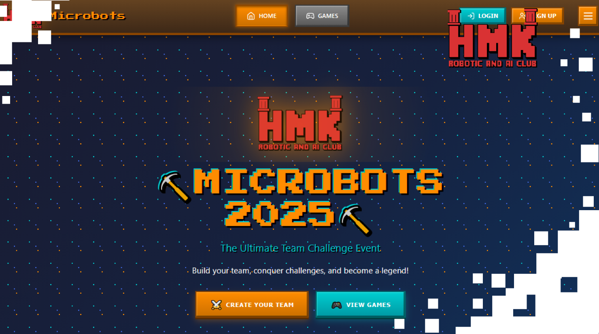
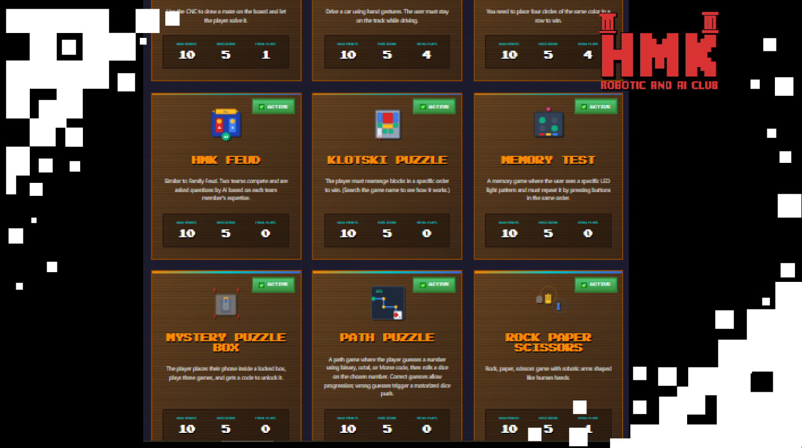
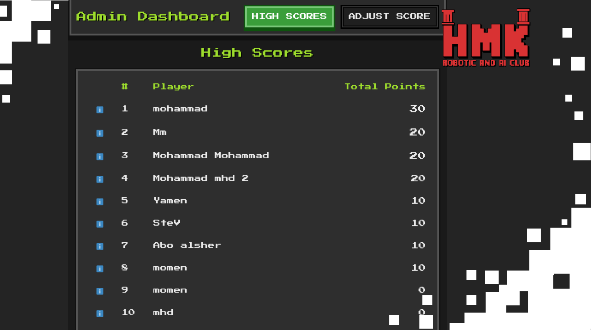
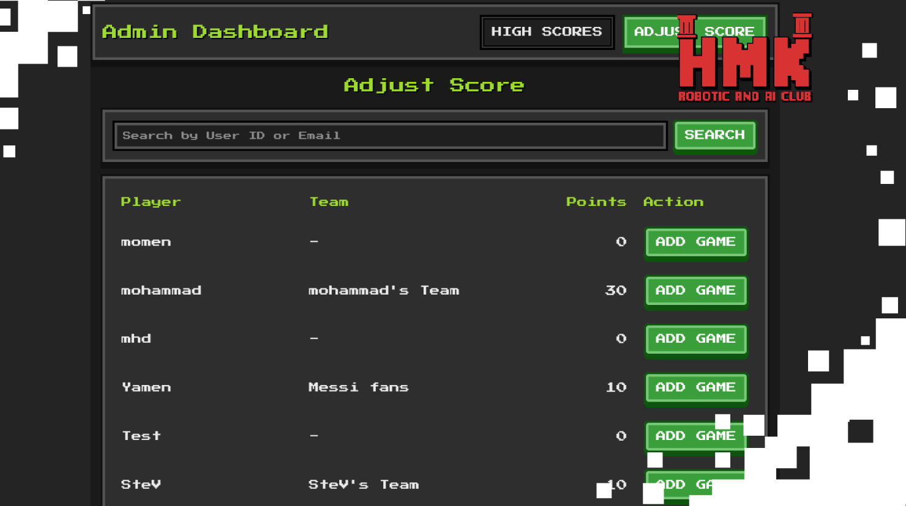
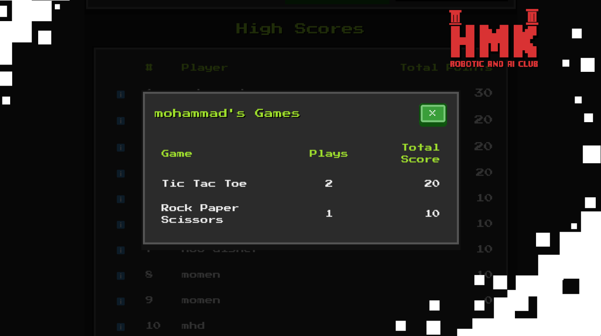

# 🎯 Game Scoring System

## 📅 Project Timeline & Context

- **Event:** FMEE 2025 – **AI & Robotics Club** Open Day
- **Date:** November 10–11–12, 2025

## 💡 Project Overview
The **Game Scoring System** is designed to manage visitor attendance and track scores during exhibitions or events.  
Each visitor logs in via a unique **QR code**, allowing the system to record their participation and game performance.  

At the end of the event, a **leaderboard** displays the top-scoring visitors in real-time.  
The system includes:
- An **Admin Dashboard** for managing users, scores, and settings.
- A **Visitor Page** where participants can view their personal data and total points.

---

## ⚙️ Components Used
- **QR Readers** – for scanning visitor codes and logging participation  
- **Server** – for backend processing and data synchronization  
- **Display Screens or Computers** – for showing real-time results and leaderboards  

---

## 💻 Software & Tools Used
- **Frontend:** React  
- **Backend:** Django  
- **Database:** MongoDB  

---

## 👨‍💻 Contributors:
Special thanks to : 

- **Mohammad Mohammad**  [LinkedIn](https://www.linkedin.com/in/mohammad-mohammad-93917a252/)
- **Momen Defdaa**  [LinkedIn](https://www.linkedin.com/in/momen-defdaa-0a18a0258)  

---

### 🏁 Key Features
- QR-based visitor login system  
- Real-time score tracking  
- Interactive leaderboard display  
- Admin dashboard for management and analytics  

---

### 🚀 Future Enhancements
- Mobile app integration  
- Support for multiple events  
- Enhanced analytics and data visualization  

---
## 📸 Screenshots

---
## 📸 Demo
**Coming soon!**

---

### 📜 License
This project is open-source and available under the [MIT License](LICENSE).

---

**Made with ❤️ for interactive exhibitions and engaging experiences.**
